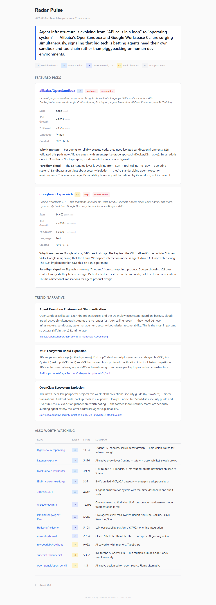
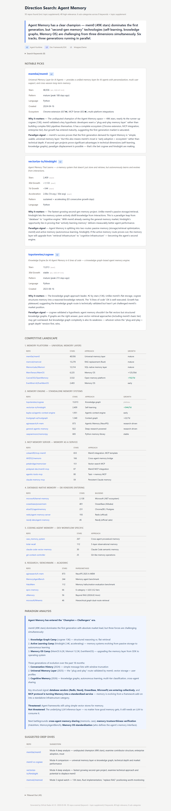
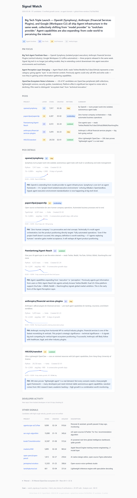
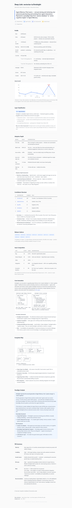

<h1 align="center">AI PM / Builder Skills</h1>

<p align="center">
  <b>Skills for AI product managers and builders.</b><br>
  AI 产品经理 / Builder 的技能包。
</p>

<p align="center">
  <b>English</b> · <a href="./README_CN.md">中文文档</a>
</p>

<p align="center">
  
  
  
</p>

---

After 10 years as an AI product manager, I believe that understanding and analyzing tech trends through the pulse of open-source projects has become a core competency for PMs, especially AI PMs.

Today I'm open-sourcing one of my tech observation skills. It helps you see not just data and project lists, but open-source trends and insights. Install it with Claude Code or OpenClaw, and as a PM or AI builder, you'll see results you didn't expect.

## Skills

| # | Skill | Description | Preview |
|---|-------|-------------|---------|
| 1 | [GitHub Trend Observer](./github-trend-observer/) | Tech trend observation engine. 4 modes to scan GitHub for emerging AI projects. | [Live Examples →](https://kun-0546.github.io/ai-pm-builder-skills/examples/) |
| 2 | Coming soon | | |

---

## Skill 1: GitHub Trend Observer

Scans GitHub for emerging AI projects, detects growth signals, and produces paradigm-level insights across four modes.

### Report Preview

| Radar Pulse | Direction Search |
|:-----------:|:----------------:|
|  |  |
| Weekly scan for high-potential projects | Deep search on a tech direction |

| Signal Watch | Deep Link |
|:------------:|:---------:|
|  |  |
| Global abnormal growth detection | Single repo deep analysis |

### Four Modes

| Mode | Name | Purpose | Command |
|------|------|---------|---------|
| 1 | **Radar Pulse** | Daily/weekly scan for high-potential new projects | `radar_pulse.py --days 7` |
| 2 | **Direction Search** | Multi-keyword search for a tech direction | `search_repos.py "agent memory"` |
| 3 | **Signal Watch** | Detect abnormal growth signals (triple-window scan) | `watch_signals.py` |
| 4 | **Deep Link** | Single repo deep analysis: ecosystem, competitors, adoption | `deep_link.py owner/repo` |

### How It Works

```
┌─────────────┐     ┌──────────────┐     ┌──────────────┐
│  Python      │     │  AI Agent    │     │  HTML Report  │
│  Scripts     │────▶│  (Analysis)  │────▶│  (Output)     │
│  (Data Only) │     │  Layer Model │     │  Templates    │
└─────────────┘     └──────────────┘     └──────────────┘
     gh CLI              skill.md          en/ or cn/
     GitHub API          analyzer.md       templates
```

**Scripts** collect raw data (stars, commits, contributors, growth). **No AI in scripts.**

**Agent** reads `skill.md` + `analyzer.md`, applies the L1-L5 Layer model, and fills HTML templates with PM-grade insights.

### Layer Framework

Every project is classified L1-L5:

| Layer | Name | Example | PM Priority |
|-------|------|---------|-------------|
| L1 | Model/Inference | llama.cpp, vLLM | Low |
| L2 | Agent Runtime | memory, tool-calling, orchestration | **High** |
| L3 | Dev Framework/SDK | frameworks you `pip install` | **High** |
| L4 | Vertical Product | AI products for end users | Medium |
| L5 | Wrapper/Demo | thin wrappers, tutorials | Low |

L2 and L3 carry the strongest signal for infrastructure shifts.

### Quick Start

#### 1. Install Prerequisites

- **Python 3.9+** — [python.org/downloads](https://www.python.org/downloads/)
- **gh CLI** — [cli.github.com](https://cli.github.com/)

#### 2. Authenticate gh CLI

```bash
gh auth login
# Follow the prompts — select GitHub.com, HTTPS, and authenticate via browser.
# This gives you 5,000 API requests/hour (vs 60/hour unauthenticated).
```

#### 3. Run

```bash
cd github-trend-observer

# Check API quota
python scripts/check_rate_limit.py

# Pick a mode and run
python scripts/radar_pulse.py --days 7              # Mode 1
python scripts/search_repos.py "agent memory"       # Mode 2
python scripts/watch_signals.py                      # Mode 3
python scripts/deep_link.py langchain-ai/langgraph   # Mode 4

# Generate report (EN or CN)
python scripts/generate_report.py analysis.json --mode radar-pulse --lang en
python scripts/generate_report.py analysis.json --mode radar-pulse --lang cn
```

### Project Structure

```
github-trend-observer/
├── scripts/                     # Data collection scripts
│   ├── gh_utils.py              # gh CLI utilities
│   ├── radar_pulse.py           # Mode 1: trending discovery
│   ├── search_repos.py          # Mode 2: direction search
│   ├── watch_signals.py         # Mode 3: signal detection
│   ├── deep_link.py             # Mode 4: deep analysis
│   ├── fetch_star_history.py    # Star growth timeline
│   ├── generate_report.py       # Report generation (--lang en/cn)
│   ├── check_rate_limit.py      # API rate limit check
│   └── test_oss.py              # Automated tests (6 tiers, 33 tests)
├── en/                          # English: skill.md, templates, references
├── cn/                          # 中文: skill.md, 模板, 参考文档
├── config/                      # seed_list.json, domain_keywords.json
└── requirements.txt
```

### Requirements

| Dependency | Version | Check |
|------------|---------|-------|
| [gh CLI](https://cli.github.com/) | >= 2.40.0, authenticated | `gh auth status` |
| Python | >= 3.9 | `python --version` |
| Extra packages | None (stdlib only) | — |
| API quota | 5000 req/hour (authenticated) | `python scripts/check_rate_limit.py` |

### Using with AI Agents

This skill is designed for AI coding agents (Claude Code, OpenClaw, etc.). The agent:

1. Runs Python scripts to collect data
2. Reads `{lang}/skill.md` for execution instructions
3. Reads `{lang}/agents/analyzer.md` + `{lang}/references/layer_model.md` for analysis framework
4. Fills `{lang}/templates/*.html` with insights to produce reports

Scripts are pure data collection. All intelligence comes from the agent applying the Layer model and PM analysis framework.

## License

MIT
