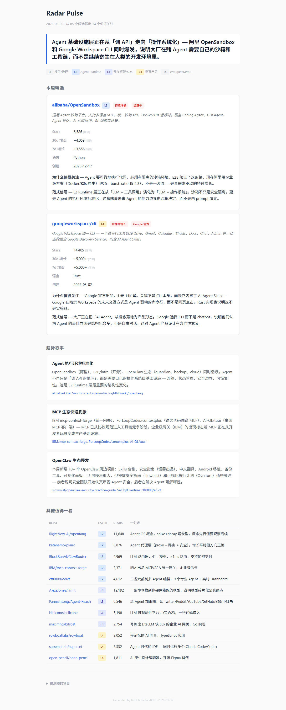
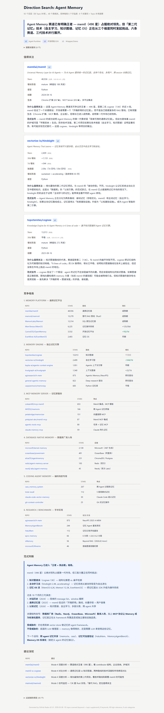
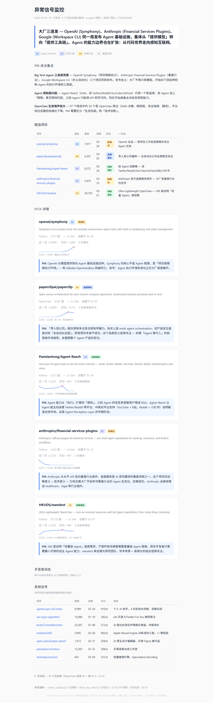
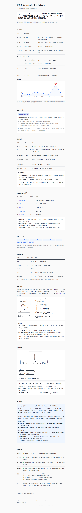

<h1 align="center">AI PM / Builder Skills</h1>

<p align="center">
  <b>AI 产品经理 / Builder 的技能包。</b><br>
  Skills for AI product managers and builders.
</p>

<p align="center">
  <a href="./README.md">English</a> · <b>中文文档</b>
</p>

<p align="center">
  
  
  
</p>

---

我做了十年 AI 产品经理。在 AI 日新月异的今天，通过开源项目的技术脉络来理解和判断趋势，已经是产品经理（尤其是 AI 产品经理）的核心能力。

今天我把自己用的其中一个技术观察 Skill 开源了。它可以帮助你不只看到数据和项目列表，还可以看到开源的趋势与洞察。你可以用 Claude Code 或 OpenClaw 直接安装使用，作为产品经理或 AI Builder 的你，会看到意想不到的结果。

## 技能列表

| # | 技能 | 说明 | 预览 |
|---|------|------|------|
| 1 | [GitHub Trend Observer](./github-trend-observer/) | 科技趋势观察引擎，4 种模式扫描 GitHub 上的新兴 AI 项目 | [在线示例 →](https://kun-0546.github.io/ai-pm-builder-skills/examples/) |
| 2 | 即将推出 | | |

---

## 技能 1：GitHub Trend Observer — 科技趋势观察

扫描 GitHub 上的新兴 AI 项目，检测增长信号，产出范式级洞察。支持四种模式。

### 报告预览

| Radar Pulse | Direction Search |
|:-----------:|:----------------:|
|  |  |
| 每周扫描高潜新项目 | 深度搜索一个技术方向 |

| Signal Watch | Deep Link |
|:------------:|:---------:|
|  |  |
| 全局异常增长信号检测 | 单个 Repo 全方位深度分析 |

### 四种模式

| 模式 | 名称 | 用途 | 命令示例 |
|------|------|------|---------|
| 1 | **Radar Pulse** | 每日/每周扫描，发现高潜新项目 | `radar_pulse.py --days 7` |
| 2 | **Direction Search** | 多关键词搜索一个技术方向 | `search_repos.py "agent memory"` |
| 3 | **Signal Watch** | 检测异常增长信号（三窗口扫描） | `watch_signals.py` |
| 4 | **Deep Link** | 单个 repo 深度分析：生态、竞品、采纳度 | `deep_link.py owner/repo` |

### 工作原理

```
┌─────────────┐     ┌──────────────┐     ┌──────────────┐
│  Python      │     │  AI Agent    │     │  HTML 报告    │
│  脚本        │────▶│  (分析)      │────▶│  (输出)       │
│  (纯数据)    │     │  Layer 模型   │     │  模板渲染     │
└─────────────┘     └──────────────┘     └──────────────┘
     gh CLI              skill.md          cn/ 或 en/
     GitHub API          analyzer.md       templates
```

**脚本**只做数据采集（stars、commits、contributors、增长趋势）。**脚本中没有 AI。**

**Agent** 读取 `skill.md` + `analyzer.md`，应用 L1-L5 Layer 模型，将 PM 级洞察填入 HTML 模板。

### Layer 分析框架

每个项目被标注为 L1-L5 层级：

| 层级 | 名称 | 示例 | PM 优先级 |
|------|------|------|-----------|
| L1 | 模型/推理 | llama.cpp, vLLM | 低 |
| L2 | Agent Runtime | memory, tool-calling, orchestration | **高** |
| L3 | 开发框架/SDK |  `pip install` 的框架 | **高** |
| L4 | 垂直产品 | 面向终端用户的 AI 产品 | 中 |
| L5 | Wrapper/Demo | 套壳、教程 | 低 |

L2 和 L3 是基础设施变化的最强信号。

### 快速开始

#### 1. 安装前置条件

- **Python 3.9+** — [python.org/downloads](https://www.python.org/downloads/)
- **gh CLI** — [cli.github.com](https://cli.github.com/)

#### 2. 登录 gh CLI（获取 API 访问权限）

```bash
gh auth login
# 按提示操作 — 选择 GitHub.com、HTTPS、通过浏览器授权。
# 登录后可获得 5,000 次/小时 API 额度（未登录仅 60 次/小时）。
```

#### 3. 运行

```bash
cd github-trend-observer

# 检查 API 额度
python scripts/check_rate_limit.py

# 选一个模式跑
python scripts/radar_pulse.py --days 7              # 模式 1
python scripts/search_repos.py "agent memory"       # 模式 2
python scripts/watch_signals.py                      # 模式 3
python scripts/deep_link.py langchain-ai/langgraph   # 模式 4

# 生成报告（中文或英文）
python scripts/generate_report.py analysis.json --mode radar-pulse --lang cn
python scripts/generate_report.py analysis.json --mode radar-pulse --lang en
```

### 项目结构

```
github-trend-observer/
├── scripts/                     # 数据采集脚本
│   ├── gh_utils.py              # gh CLI 工具函数
│   ├── radar_pulse.py           # 模式 1: trending 发现
│   ├── search_repos.py          # 模式 2: 方向搜索
│   ├── watch_signals.py         # 模式 3: 信号检测
│   ├── deep_link.py             # 模式 4: 深度分析
│   ├── fetch_star_history.py    # star 增长数据拉取
│   ├── generate_report.py       # 报告生成 (--lang en/cn)
│   ├── check_rate_limit.py      # API 速率检查
│   └── test_oss.py              # 自动化测试（6 层 33 项）
├── en/                          # English: skill.md, templates, references
├── cn/                          # 中文: skill.md, 模板, 参考文档
├── config/                      # seed_list.json, domain_keywords.json
└── requirements.txt
```

### 依赖

| 依赖 | 要求 | 检查命令 |
|------|------|----------|
| [gh CLI](https://cli.github.com/) | >= 2.40.0，已登录 | `gh auth status` |
| Python | >= 3.9 | `python --version` |
| 额外 Python 包 | 无（仅标准库） | — |
| API 额度 | 5000 次/小时（认证状态） | `python scripts/check_rate_limit.py` |

### 与 AI Agent 协作

此技能设计为 AI coding agent（Claude Code、OpenClaw 等）的 Skill。Agent 会：

1. 运行 Python 脚本采集数据
2. 读取 `cn/skill.md` 获取执行指令
3. 读取 `cn/agents/analyzer.md` + `cn/references/layer_model.md` 获取分析框架
4. 用 `cn/templates/*.html` 填充洞察，生成最终报告

脚本只做数据采集（无 AI）。所有智能来自 Agent 应用 Layer 模型和 PM 分析框架。

## License

MIT
